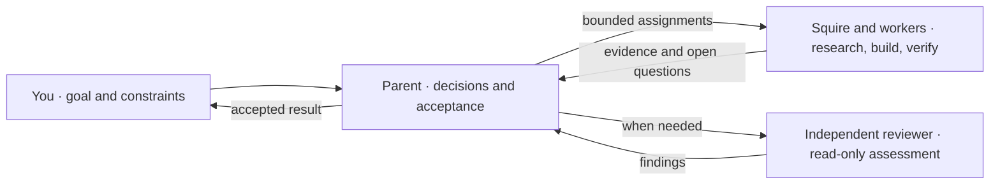

<div align="center">

# Codex Orchestrator

**Keep the decisions. Delegate the work.**

A Codex plugin for coordinating native agents around a clear division of responsibilities.

Native agents · Model-agnostic orchestration · MIT licensed

[Quick start](#quick-start) · [How it works](#how-it-works) · [Model routing](#optional-model-routing) · [Migration](#migrating-from-astra-advisor)

</div>

Your selected model stays in charge of scope, decisions, and acceptance. A
**retained squire** — a delegate reused across related assignments — handles
research and execution. Independent reviewers assess changes when the work calls
for it.

The plugin packages this workflow as an [orchestration skill](plugins/codex-orchestrator/skills/orchestration/SKILL.md).
These are instructions for agents using the host's native tools; available
capabilities, your instructions, and repository permissions govern what can run.

## Quick start

**Requires:** Codex with plugin support and native agent delegation tools.

From the root of this checkout, register the marketplace and install the plugin:

```sh
codex plugin marketplace add .
codex plugin add codex-orchestrator@codex-orchestrator
```

Start a fresh task, select your preferred parent model, and give it a concrete goal:

```text
Use $codex-orchestrator:orchestration to fix the empty-search bug.
Reproduce it, make the smallest fix, run the affected tests, and review the diff.
```

Follow-ups can reuse the same squire while its context remains useful. The parent
keeps the user conversation and decides what to do with the returned evidence.

## How it works



| Responsibility | How the skill assigns it |
| --- | --- |
| **Frame and decide** | The parent sets the objective, scope, ownership, and expected result; interprets evidence; and accepts the work. It can answer directly from existing evidence. |
| **Research and execute** | The squire investigates, implements, verifies, and follows up within its assignment. It can coordinate workers when authorized. |
| **Review independently** | The parent requests a read-only acceptance review for changes to behavior, supported contracts, or authority boundaries, or when acceptance needs independent evidence. |
| **Report honestly** | Delegates return sources, completed actions and checks, uncertainty, and unresolved decisions. The parent reports observed results and material limitations. |

Assignments carry explicit scope and permissions. A research request does not
authorize edits. After a bounded correction, the workflow uses affected checks and
targeted review confirmation; wording-only changes need parent assessment.

## What's included

| Component | Purpose |
| --- | --- |
| [Orchestration skill](plugins/codex-orchestrator/skills/orchestration/SKILL.md) | Instructions for delegation, squire reuse, review, and acceptance. |
| [Hooks](plugins/codex-orchestrator/hooks/hooks.json) | Once trusted, add a brief delegation reminder to each prompt and copy missing bundled profiles into the separate router's configuration directory. |
| [Cost calculator](plugins/codex-orchestrator/scripts/cost_receipt.py) | Produces API-equivalent estimates from supplied usage records and a versioned pricing snapshot. |

The orchestration skill needs no additional SDK or API key. Automatic model
selection is an optional integration described below.

## Optional model routing

Install and configure [codex-subagent-router](https://github.com/guilhem/codex-subagent-router)
separately to use Jev for model and effort selection on eligible native agent
spawns. That plugin owns the routing hook, SDK, and `TYPESAFE_API_KEY` setup.

Codex Orchestrator supplies three editable profiles:

| Profile | Assigned work | Model | Effort |
| --- | --- | --- | --- |
| [Routine](plugins/codex-orchestrator/routing/codex-orchestrator-routine.json) | Evidence collection, status checks, and bounded execution of existing commands. | `gpt-6-luna` | `max` |
| [Implementation](plugins/codex-orchestrator/routing/codex-orchestrator-implementation.json) | Ordinary code changes, tests, technical analysis, and review under a clear contract. | `gpt-6-sol` | `high` |
| [Complex](plugins/codex-orchestrator/routing/codex-orchestrator-complex.json) | Difficult diagnosis, architectural tradeoffs, and work with material security or data integrity risk. | `anthropic/claude-opus-5-5` | `high` |

To install them, trust **Install Codex Orchestrator routing profiles** in Codex's
hook settings, then start a new session. The `SessionStart` hook copies missing
`codex-orchestrator-*.json` files to `$CODEX_HOME/subagent-router/`, falling back to
`~/.codex/subagent-router/` when `CODEX_HOME` is unset. It provides shell and
PowerShell commands for macOS/Linux and Windows respectively.

Edit the installed profiles to customize routing. Existing files are preserved.
To restore a bundled profile, delete its installed copy and start a new session;
disable the hook before removing the profiles permanently.

The skill leaves model and effort unset unless intentionally pinned. User and
repository requirements still apply. A routing choice records selection;
confirming which model actually ran requires runtime evidence.

## Usage and cost estimates

Ask for a receipt when you need usage or cost details. The workflow uses observed
token usage when available and identifies missing data. The calculator estimates
USD cost from the bundled **2026-09-04** pricing snapshot and can reprice the same
tokens at Astra rates, independently of your selected parent model.

The bundled snapshot does not include rates for the three current routing
profiles. Estimates for those models remain unavailable unless you supply a
compatible pricing snapshot with `--pricing PATH`.

These are historical API-equivalent estimates. Same-token repricing does not
measure actual task savings or changes to subscription charges.

<details>
<summary>Try the calculator with illustrative data</summary>

This fixture is an example, not usage from your task:

```sh
python3 plugins/codex-orchestrator/scripts/cost_receipt.py \
  plugins/codex-orchestrator/examples/illustrative-usage.json
```

The command emits JSON. See the [input contract and receipt policy](plugins/codex-orchestrator/skills/orchestration/references/cost-receipts.md)
for usage provenance, partial coverage, supported pricing, and `--pricing PATH`.

</details>

## Migrating from Astra Advisor

The plugin and marketplace are now named `codex-orchestrator`. Existing
installations are not renamed automatically. Remove the old registration, then
follow [Quick start](#quick-start) using this checkout:

```sh
codex plugin remove astra-advisor@astra-advisor
codex plugin marketplace remove astra-advisor
```

- Update `$astra-advisor:orchestration` references in your instructions to `$codex-orchestrator:orchestration`.
- Move customizations from installed `astra-*.json` profiles to the new profiles, then remove obsolete copies to avoid duplicate routing choices.
- Update external settings that reference old profile IDs; those IDs are the filenames without `.json`.

The project is maintained at [`guilhem/codex-orchestrator`](https://github.com/guilhem/codex-orchestrator).

## Development and reference

Run the existing package validator and tests:

```sh
sh plugins/codex-orchestrator/scripts/verify.sh
```

The verifier checks packaging, references, README links, and the bundled tests.
CI also runs the profile installation test on Windows. These checks cover the
package and scripts; live host discovery and model routing need host validation.

| Read more | Covers |
| --- | --- |
| [Native delegation](plugins/codex-orchestrator/skills/orchestration/references/operations.md) | Assignment boundaries, optional advice, and separately requested app tasks. |
| [Retained squire](plugins/codex-orchestrator/skills/orchestration/references/squire.md) | Reuse, reporting, and handoffs. |
| [Independent review](plugins/codex-orchestrator/skills/orchestration/references/review.md) | Acceptance criteria and correction follow-ups. |
| [Cost receipts](plugins/codex-orchestrator/skills/orchestration/references/cost-receipts.md) | Usage evidence and supported cost estimates. |

---

Maintained by [Guilhem Lettron](https://github.com/guilhem). Derived from
[Astra Advisor](https://github.com/DannyMac180/astra-advisor) by Daniel McAteer.
[MIT licensed](LICENSE), with the original copyright attribution preserved.
